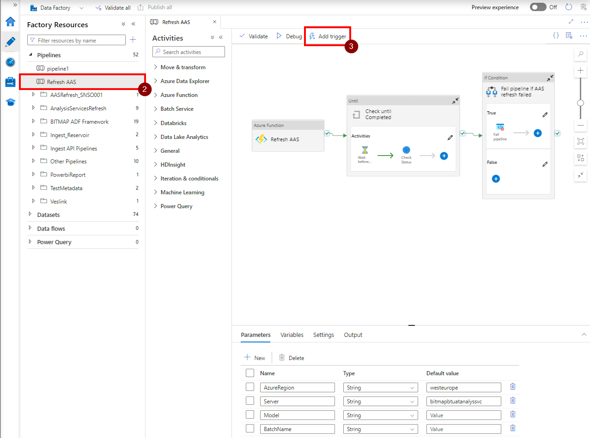
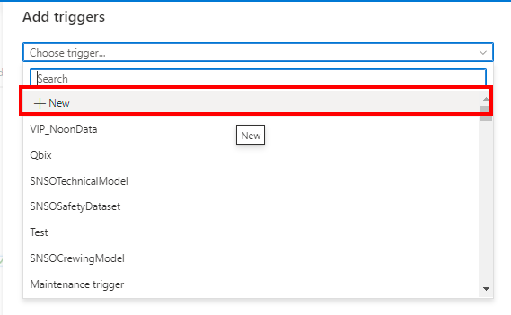
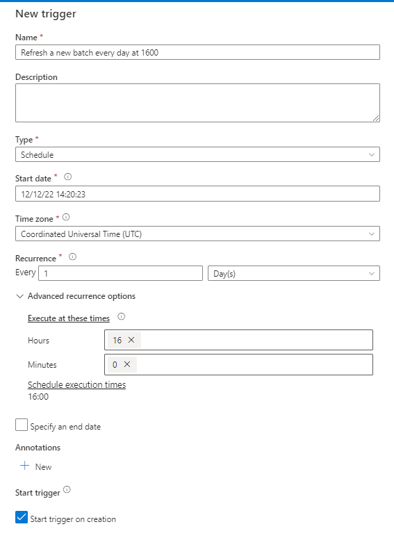
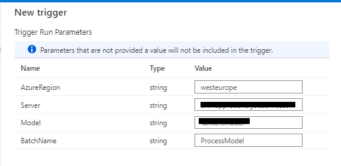

# How to setup new batches for the Processing Manager

## Create a new batch

How to create a new batch in the model is explained in the ReadMe.md file in this same folder under "Usage of Processing Manager".

## Create a new trigger in Azure Data Factory to trigger the new batch

1. Go to the Azure Data Factory instance from which you want to trigger the new batch.
2. Go to the "Refresh AAS" Pipeline.
3. Click on "Add new trigger".

4. Click on "New" from the dropdown.

4. Setup the trigger schedule.

5. Enter the correct trigger parameters. In this case a batch called "ProcessModel" will be refreshed by this trigger.

6. Click on OK and make sure to publish the changes. You're all done :)